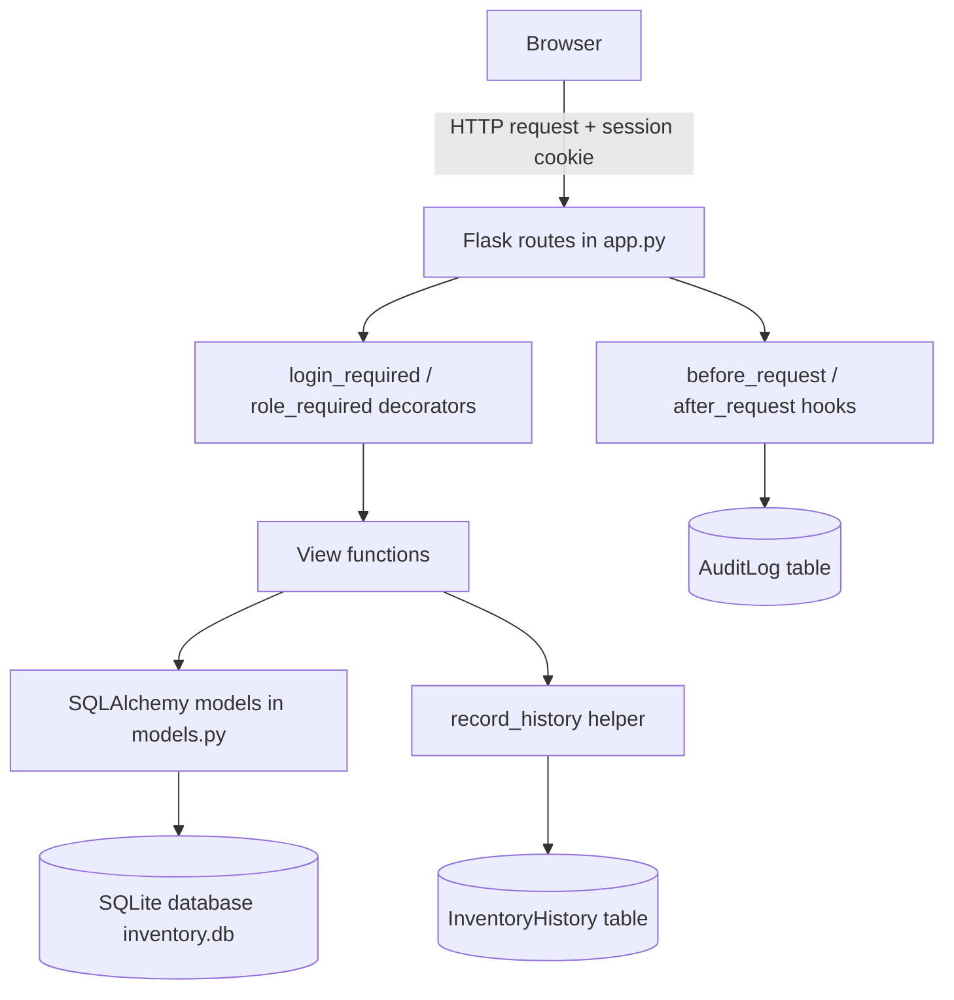

# Starfleet Academy Operations Inventory Management System: Report

## 1. Implementation phase

### 1.1 Requirements

The three scenarios below are given as BDD requirements. Each asks for something specific:

1. RBAC needs an identity and a decision point checking it on every relevant action, not just at login.
2. Inventory records need writes to be attributable and explainable later, even once the underlying data is gone.
3. Audit logging, "any user performs an action" rather than "any write action", is broader than the other two.

Feature: Operations Inventory Management System for Starfleet Academy  
As a Starfleet administrator  
I want to manage the inventory of scientific resources and archival materials efficiently  
So that I can ensure accurate tracking, availability, and secure access across the fleet.

Scenario: Role-Based Access Control (RBAC)  
Given different user roles (Command Officer, Cadet)  
When a user logs into the system  
Then the system should grant access based on their Starfleet clearance level  
And restrict unauthorised actions such as modifying inventory or accessing mission audit logs.

Scenario: Define and Manage Inventory Records  
Given I am logged in as a Command Officer  
When I add, update, or remove a resource from the inventory  
Then the system should reflect the changes  
And maintain a history of modifications for audit and mission traceability.

Scenario: Audit Logging of System Activity  
Given any user performs an action  
When the action is completed  
Then the system should log the event with stardate, user ID, and action details  
So that Starfleet administrators can review system usage and detect anomalies or breaches.

#### Requirements Mapping

I've mapped each scenario to the implementation and the test that proves it.

| Scenario                            | Implementation                                                                                                                                                                                                       | Evidence                                                                 |
| ----------------------------------- | -------------------------------------------------------------------------------------------------------------------------------------------------------------------------------------------------------------------- | ------------------------------------------------------------------------ |
| Role-Based Access Control (RBAC)    | `role_required`/`login_required` decorators (`app.py`) gate every write route and the audit log, checked against the role stored in the signed session cookie set at login                                           | `test_cadet_blocked_from_add_item`, `test_officer_permitted_to_add_item` |
| Define and Manage Inventory Records | `add_inventory_item` and `inventory_item` (GET/PUT/POST/DELETE) handle create/update/remove. Removal is a soft delete via `is_removed`. Every change writes a row through `record_history()` into `InventoryHistory` | `test_history_recorded_for_create_update_remove`                         |
| Audit Logging of System Activity    | `AuditLog` model plus `before_request`/`after_request` hooks log every request with timestamp, user ID, and outcome (success/denied/unauthenticated/failure)                                                         | `test_audit_log_covers_unauthenticated_denied_and_success`               |

### 1.2 System Overview

#### Architecture

I built it so every request passes through the decorators and the `before_request`/`after_request` hooks before reaching a view function. This makes the audit log unconditional, and is why RBAC cannot be bypassed by hitting a route directly instead of going through the browser.

`app.py` has two layers on top of this: five helper functions (two decorators for auth, one for writing history rows, two request hooks for audit logging) and eleven route functions. Almost every route follows the same structure:
1. Check the request is allowed
2. Read the submitted data
3. Validate it
4. Write to the database
5. Flash a message and redirect or return JSON

Once that's clear for one route, the rest are the same steps with different fields, not new logic each time. The exceptions are the decorators themselves and `/inventory/<id>`, which handles four HTTP methods in one function.

**Helper functions**

| Function                       | Type                  | Purpose                                                                             |
| ------------------------------ | --------------------- | ----------------------------------------------------------------------------------- |
| `login_required(f)`            | Decorator             | Redirects to login if no session exists                                             |
| `role_required(*roles)`        | Decorator factory     | Redirects if no session, or if the session's role isn't in `roles`                  |
| `record_history(item, action)` | Helper                | Writes one snapshot row to `InventoryHistory`                                       |
| `reset_audit_outcome()`        | `before_request` hook | Resets `g.audit_outcome` to `"success"` at the start of every request               |
| `log_request(response)`        | `after_request` hook  | Writes one `AuditLog` row per request, using whatever `g.audit_outcome` ended up as |

**Routes**

| Function                          | Route                                 | Access                                  | Purpose                                          |
| ---------------------------------- | ------------------------------------- | --------------------------------------- | ------------------------------------------------ |
| `home()`                          | `GET /`                               | Public                                  | Login page if logged out, dashboard if logged in |
| `list_inventory()`                | `GET /inventory`                      | Any logged in role                      | Lists non removed items as JSON                  |
| `inventory_item(item_id)`         | `GET/PUT/POST/DELETE /inventory/<id>` | GET: any role. PUT/POST/DELETE: officer | View, update, or soft delete one item            |
| `inventory_item_history(item_id)` | `GET /inventory/<id>/history`         | Any logged in role                      | Returns that item's modification history as JSON |
| `audit_log()`                     | `GET /audit-log`                      | Officer only                            | Renders the audit log page                       |
| `login()`                         | `POST /login`                         | Public                                  | Authenticates and sets the session               |
| `logout()`                        | `POST /logout`                        | Any logged in role                      | Clears the session                               |
| `add_inventory_item()`            | `POST /inventory/add`                 | Officer only                            | Creates a new item                               |
| `add_user()`                      | `POST /user/add`                      | Officer only                            | Creates a new user account                       |
| `temp_add_user()`                 | `GET /user/temp_add`                  | Public (development only)               | a test cadet or officer account                  |
| `temp_add_item()`                 | `GET /item/temp_add`                  | Public (development only)               |  a test inventory item                           |

#### 1.2.1 Code stack and why

Python

- Flask
- SQL Alchemy
- SQLite
- HTML + Jinja template engine

I chose Python as it's my strongest language, versatile, and quick to spin up a small web server in, with a large library ecosystem for the API and front end.

I've used SQLAlchemy as the ORM since it's the most common choice in industry, with plenty of documentation available. SQLite avoids the overhead of a live server database, since this project is local and doesn't need concurrent access from multiple users.

I've opted for HTML and Jinja templating as I'm most comfortable in this stack, not what's typically used in industry, but easier to work with for a project this size than a separate front end framework would have been.

I originally built login with JWT (flask-jwt-extended), the standard approach for a REST API. I switched to session cookies once building the browser GUI started, because JWT only works if the client attaches the token to every request itself, meaning JavaScript reading the token and setting a header on every fetch call. Since the GUI needed to run on plain HTML forms with no JavaScript, that was not compatible. A session cookie is sent back by the browser automatically, so switching let me drop the JavaScript layer entirely and keep the front end to just Jinja templates and forms.

#### 1.2.2 The Models

The database has four models:
1. `User`
2. `InventoryItems`
3. `InventoryHistory`
4. `AuditLog`

`User` stores the username, a hashed password (via werkzeug's `generate_password_hash`, so nothing is stored in plaintext), and a role field: `cadet` or `command_officer`.

`InventoryItems` stores the name and quantity of a resource, plus an `is_removed` flag. I added `is_removed` before history or audit logging existed as a requirement, since permanently deleting a row would leave nothing for a history table to point back to. Soft deleting just flags the row instead.

`InventoryHistory` and `AuditLog` both carry a `user_id` linking back to `User`, making it possible to say *who* did something, not just that it happened. Rather than store a diff each time an item changes, `InventoryHistory` stores a full snapshot after each change. This uses more storage than a diff would, but any row can be read back on its own without replaying earlier changes to work out what it looked like.

| Model | Key fields | Purpose |
|---|---|---|
| `User` | `id`, `username`, `password_hash`, `role` | Accounts and role based access (`cadet` / `command_officer`) |
| `InventoryItems` | `id`, `name`, `quantity`, `is_removed` | Inventory resources. `is_removed` is the soft delete flag |
| `InventoryHistory` | `id`, `item_id` (FK), `user_id` (FK), `action`, `timestamp`, `name_snapshot`, `quantity_snapshot` | One row per create/update/remove, a full snapshot rather than a diff |
| `AuditLog` | `id`, `user_id` (FK, nullable), `path`, `method`, `outcome`, `timestamp` | One row per request. `user_id` is null when the request was unauthenticated |

#### 1.2.3 The Routes

I split the routes into reads (any logged in role) and writes (command officer only), so the RBAC boundary sits at that read/write line rather than per route.

`/` shows the login page if nobody's logged in, or the dashboard if they are. `/login` and `/logout` handle authentication through the session cookie. `/inventory` (GET) lists all non removed items to any logged in user, and `/inventory/add` (POST) lets an officer create one.

`/inventory/<id>` is one route accepting GET, PUT, POST and DELETE, with GET open to any role and PUT/DELETE restricted to officers. It is one route rather than four because curl and Postman can send real PUT/DELETE requests, but a plain HTML form can only send GET or POST, so the edit and remove buttons both POST to the same URL, with a hidden `_action=delete` field telling the route which one it is meant to be doing.

`/inventory/<id>/history` returns an item's modification history, open to any role. `/user/add` lets an officer create an account. `/user/temp_add` and `/item/temp_add` are unauthenticated development routes for seeding a test user and item, needed because once `/user/add` requires an officer, nothing can create the first one.

`/audit-log` lists every logged action and is restricted to officers, satisfying the requirement to restrict access to mission audit logs.

### 1.3 Code walkthrough

#### 1.3.1 The Login/Role Required Decorators

A decorator is a function that takes another function as its input and returns a replacement function in its place. `login_required` and `role_required` are decorators applied to routes such as `add_inventory_item`, and their job is to decide whether the real route is allowed to run.

The part that took me a while to understand is timing. The decorator itself only runs once, at the moment the application starts up and Python reads through `app.py` to determine what each route does. It cannot be the mechanism that checks a session on every visit, because no request exists yet at that point. The application has not started serving anything. So what `login_required` actually does is build a second function, called `wrapper`, and return that instead of running any check itself. `wrapper` is the function Flask calls every time someone visits the route, freshly, on each request. This is the reason `wrapper` exists at all: the decorator sets things up once, but the checking itself must happen repeatedly, so it needs its own function to live inside.

`wrapper` itself is simple. If `user_id` is not present in the session, it redirects to the login page and the real route never runs. If it is present, the real route runs as normal.

`role_required` performs the same kind of check but needs to know which role to check for, and that differs between routes. `command_officer` is required for adding an item, for example. It therefore takes an extra step: `role_required("command_officer")` runs first and builds a `wrapper` that remembers that specific role, then checks `session.get("role")` against it on every request, in the same way `login_required` checks for a session at all.

I also had to use `@wraps(f)` from Python's `functools` module on both decorators. Without it, every `wrapper` function is literally named `wrapper`, and Flask uses that name internally to distinguish routes from one another. Two routes sharing the same decorator would therefore appear identical to Flask and cause the application to crash on startup, as though the same route had been registered twice. `@wraps(f)` copies the real route's name back onto `wrapper` so Flask can tell them apart.

Both decorators only ever trust the session, never anything the request itself claims. The session is a cookie signed by the server, so the browser can send it back but cannot edit it without the server noticing, unlike a form field or header, which is simply whatever the client typed in. The role checked always comes from that signed cookie, set at login, never from anything the client could fill in themselves.

### 1.4 Test cases

The 4 following areas were outlined in the user requirements and therefore have corresponding tests.

The login works, roles are enforced both ways, changes are tracked, and actions are logged including refusals, rather than a manual click through I did once and did not repeat.

| Test                                                                      | Proves                                                                                  | Requirement                                       |
| ------------------------------------------------------------------------- | --------------------------------------------------------------------------------------- | ------------------------------------------------- |
| `test_login_success` / `test_login_failure`                               | Auth accepts valid credentials and rejects invalid ones                                 | Auth precondition underlying RBAC                 |
| `test_cadet_blocked_from_add_item` / `test_officer_permitted_to_add_item` | Role enforcement works in both directions, not just "logged in = allowed"               | RBAC scenario                                     |
| `test_history_recorded_for_create_update_remove`                          | Full create, update, remove lineage is captured with the correct snapshots at each step | Inventory records / modification history scenario |
| `test_audit_log_covers_unauthenticated_denied_and_success`                | Unauthenticated, denied, and successful attempts all get logged, not just successes     | Audit logging scenario                            |

## 2. Critical Reflection

### 2.1 How secure build practices reinforce the integrity and trustworthiness

I compiled and ran every stage against a live version of the app before considering it finished, instead of assuming it worked.

The audit log shows why rechecking implementation against the original requirement matters, not just against my own plan. I had initially scoped it to only `/login` and `/inventory*`, but the user requirement says "*any* user performs *an* action", broader than what I had built. Separately, the RBAC scenario's line about restricting access to "mission audit logs" implied a route to view the log needed to exist and be protected, which it did not yet. Neither gap would have been caught by testing what already existed, only by rereading the requirement itself.

Two real bugs came from writing the pytest suite, not manual testing. 
First, `flask.g` should reset every request, but my test fixture wrapping requests in a single app context let a value leak from one request into the next, meaning a denied action could log as a success, exactly what an audit log exists to prevent. I only found it because a test asserted the exact outcome string, not  because the request did not error. 
Second, my tests were quietly writing to the real database, because Flask-SQLAlchemy fixes the database URI in place the moment `db.init_app()` runs rather than lazily on first use, confirmed with a standalone reproduction script before trusting the fix. Manual testing had not caught either bug.

Two weaknesses.
`SECRET_KEY` is hardcoded in `app.py` rather than read from an environment variable. This is acceptable for a project that never leaves my machine, but it would let anyone with source code access forge session cookies in a real deployment. 
Related to this, sessions cannot be revoked early: a compromised account or a changed role would not take effect until that session expired or the user logged out.

### 2.2 How does this system align with SSCoP

The Software Security Code of Practice (DSIT/NCSC, May 2025) targets commercial vendors selling to business customers, therefore not every principle translates onto a small internal academy system. I have mapped where the fit is an analogy rather than a literal match.

| Security Requirement and Feature                 | Description                                                                                         | Mapped Principles                                                                                                                                                                                                                                                                                                                                           |
| ------------------------------------------------ | --------------------------------------------------------------------------------------------------- | ----------------------------------------------------------------------------------------------------------------------------------------------------------------------------------------------------------------------------------------------------------------------------------------------------------------------------------------------------------- |
| Role based access control (`role_required`)      | Server side, deny by default enforcement of Cadet vs Officer on every write route and the audit log | 1.4: secure by design/default                                                                                                                                                                                                                                                                                                                               |
| Session based authentication                     | Signed cookie via Flask's built in session mechanism, not a custom rolled scheme                    | 1.1: established secure development framework                                                                                                                                                                                                                                                                                                               |
| Soft delete (`is_removed`)                       | Decided upfront, before history was even a requirement, that removal should not destroy data        | 1.4: secure by design                                                                                                                                                                                                                                                                                                                                       |
| Modification history                             | Snapshot row per create/update/remove: who, when, what                                              | 2.2: an analogy rather than a literal match. Principle 2.2 concerns controlling and logging changes to the *build* environment. There is no build pipeline in this project, but the same underlying principle, that changes should be traceable and attributable rather than silent, is what `InventoryHistory` implements at the application layer instead |
| Audit logging (`before_request`/`after_request`) | Every request logged with outcome, including denials and unauthenticated attempts                   | 2.2: the same analogy as above, applied to every request rather than just data changes                                                                                                                                                                                                                                                                      |
| pytest suite                                     | 6 tests gating each stage before it was considered complete                                         | 1.3: clear process for testing before distribution, the most direct match in this table                                                                                                                                                                                                                                                                     |

### 2.3 How does the IMS support or fall short of the SSCoP principles

I have gone by theme rather than principle since several principles within a theme land on the same assessment.

| SSCoP theme                          | Assessment                                                                                                                                                                                                                                                                               |
| ------------------------------------ | ---------------------------------------------------------------------------------------------------------------------------------------------------------------------------------------------------------------------------------------------------------------------------------------- |
| 1. Secure design and development     | **Strength**: deny by default access control, tested before each stage was considered finished. **Gap**: no named or documented secure development framework. The process was iterative and informal, not structured against a formal threat model or the topics 1.1 lists as a minimum. |
| 2. Build environment security        | **Gap, largely not applicable**: there is no real build or release pipeline here. This is a locally run app, not a compiled or packaged product. Audit logging is the closest analogue but operates at the wrong layer (application, not build environment).                             |
| 3. Secure deployment and maintenance | **Gap**: no vulnerability disclosure process, no patching or update mechanism, no dependency risk review of the packages in `requirements.txt`. These principles assume a distributed product with an ongoing lifecycle, which this project does not really have.                        |
| 4. Communication with customers      | **Not applicable**: there are no external customers. This is an internal academy system. Worth stating plainly rather than forcing a strained mapping onto a theme that does not transfer.                                                                                               |

## 3. Appendix: AI Tools

Helped me research SSCoP and understand it better
Struggled with wrappers and decorators, explained them through analogies
Formatted the report into latex
Helped debug and write test cases using pytest
Converted my iPad drawing into a Mermaid diagram
Helped write the README file
Helped write HTML code
Used for grammar, punctuation, and cutting the report down on words
 

## 4. Appendix: Codebase Access Information

See `README.md` in the project root for setup instructions. 
Github Link: 