# UniLearn Hub: Report

## Task 1: Design and Export a Secure PostgreSQL Database Schema

### 1.1 ERD

*ERD (Crow's Foot notation) to be inserted here, in progress.*

### 1.2 Entities and relationships

I built the schema as 16 tables in a dedicated `unilearn` schema, not `public`, so the database can host other schemas alongside it without name collisions.

Four tables have no foreign keys and sit at the top of the dependency graph. `Departments` and `Roles` have no dependencies at all. `Programs` depends on `Departments`. `Staff` depends on `Departments` and `Roles`. Everything else builds on top of `Students` (depends on `Programs`) and `Courses` (depends on `Programs`).

I resolved the many to many relationships with two junction tables, `Enrolments` (student and course) and `Submissions` (assignment and student). Each has a `UNIQUE` constraint on the pair of foreign keys so the same relationship can't be inserted twice. `Grades` sits one level further down, one to one with `Submissions` through a `UNIQUE NOT NULL` foreign key, so a submission has at most one grade.

`Notifications` and `Messages` model a recipient, and for `Messages` a sender, that is either a student or a staff member, never both. I explain the constraint design behind this in §1.3.

`Course_Materials`, `Assignments`, `Schedule`, `Attendance`, and `Feedback` all hang off `Courses` or `Students`, recording the day to day activity the schema exists to track. I didn't store anything beyond what these features need. No scraped or inferred personal data, no column collecting more than the stated use case requires, in line with the brief's GDPR compliance expectation.

Every primary key is a plain `INTEGER GENERATED ALWAYS AS IDENTITY` rather than a UUID, since this system has no need for multiple write nodes. A sequential key keeps joins smaller and easier to read at this scale, at the cost of row creation order being visible in the key, which I judged acceptable here.

Table screenshots below (`schema.sql`), grouped by dependency layer.

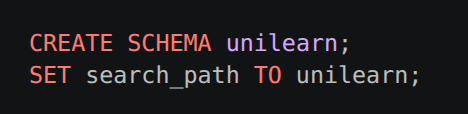
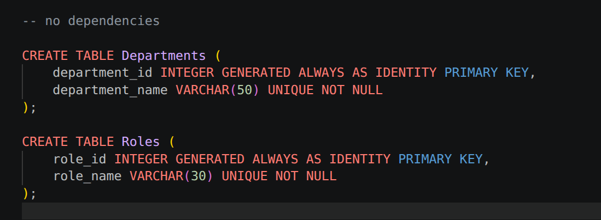
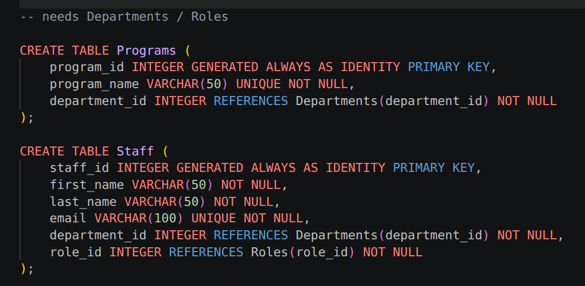
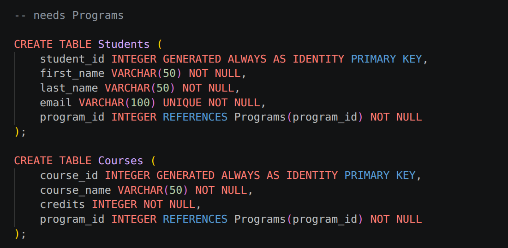
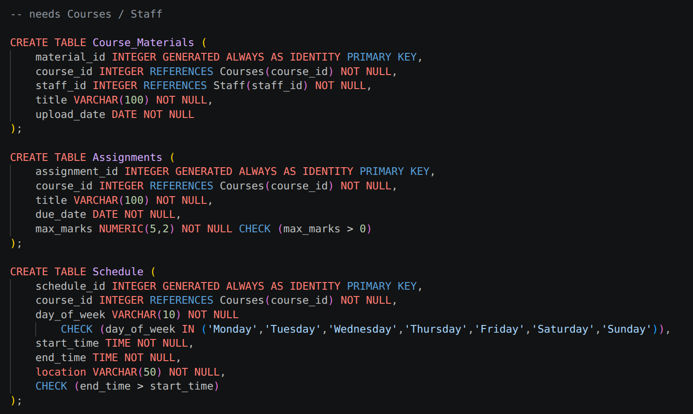
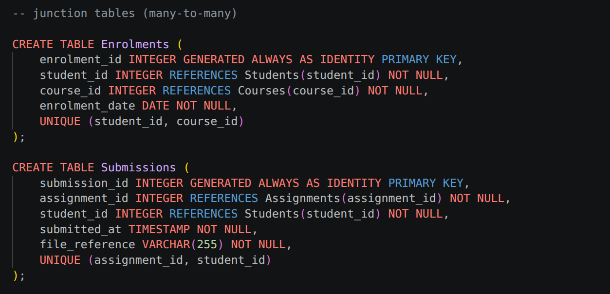
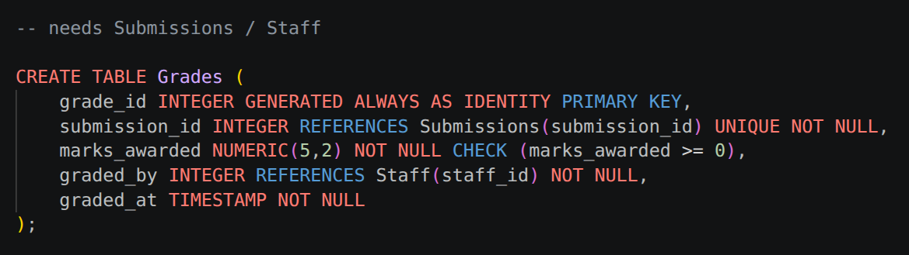
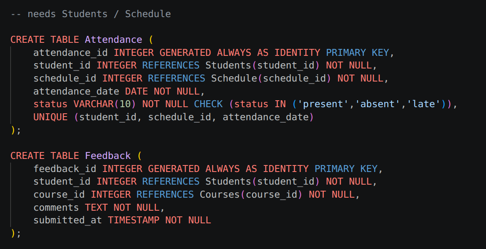
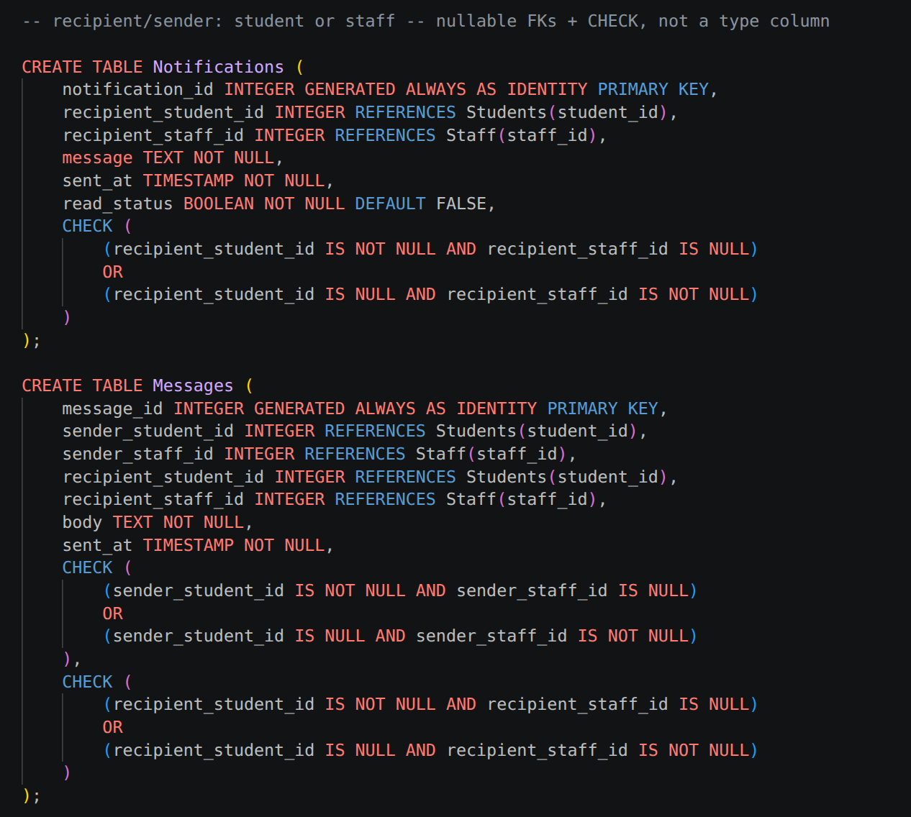

### 1.3 Normalisation and constraint design

The schema is in 3NF. Every non key column depends on the whole primary key and nothing but the key. There is no repeating group data, a course's schedule is its own table, not a set of `day1`, `day2` columns, and no column is derivable from another column in the same row rather than stored directly.

**Junction tables over multi valued columns.** A student can enrol in many courses and a course has many students. Modelling this as an array column on either side would break 1NF and make "list every student in course X" an unindexed scan. `Enrolments` and `Submissions` make both directions a plain indexed join, and their `UNIQUE (a, b)` constraints double as the business rule that a student can't enrol in the same course twice.

**Nullable FK pair plus CHECK, not a subtype column.** `Notifications` needed a recipient that is a student or a staff member. The alternative was a single `recipient_type` column plus a `recipient_id` with no foreign key at all, since one foreign key can't point at two different tables. That trades a real, database enforced foreign key for an application level convention with no constraint behind it. The `CHECK` on the two nullable FKs rejects rows where both are null or both are set, at the database layer rather than the application layer. `Messages` repeats the pattern for both sender and recipient.

**`CHECK` beyond `NOT NULL`.** `Assignments.max_marks > 0`, `Grades.marks_awarded >= 0`, `Schedule.end_time > start_time`, and `Attendance.status IN (...)` all encode a rule that is true for every valid row, so I put it in the schema rather than reimplementing it in every client that writes to these tables.

**Deliberately not built.** `Grades.marks_awarded` has no `CHECK` against its parent assignment's `max_marks`. A `CHECK` constraint can only see columns within its own row, so comparing against a different table needs a trigger. I left this out to keep the submitted schema fully trigger free and easy to reason about.

### 1.4 Roles, grants, and views

I exported four least privilege roles alongside the tables. `admin_role` gets full access. `lecturer_role` gets `SELECT, INSERT, UPDATE` on the tables lecturers actively use, `Courses`, `Course_Materials`, `Assignments`, `Submissions`, `Grades`, `Feedback`, `Schedule`, `Attendance`, and `SELECT` only on reference data, `Students`, `Enrolments`, `Departments`, `Programs`. That gives read access to the context they need and write access only to what they own. `student_role` gets `SELECT` on course facing tables, `SELECT, INSERT` on `Feedback`, and no grant at all on `Grades`. `read_only_role` gets `SELECT` across the whole schema, for reporting and audit use.

I added two views to narrow what a role sees without exposing whole tables. `Student_Grade_View` joins `Submissions`, `Assignments`, and `Grades` but omits `graded_by`, so a student sees their mark without seeing which staff member assigned it. `Course_Roster_View` omits student email from the roster a lecturer sees. `student_role` has no grant on `Grades` itself, so the view is the only path to that data.


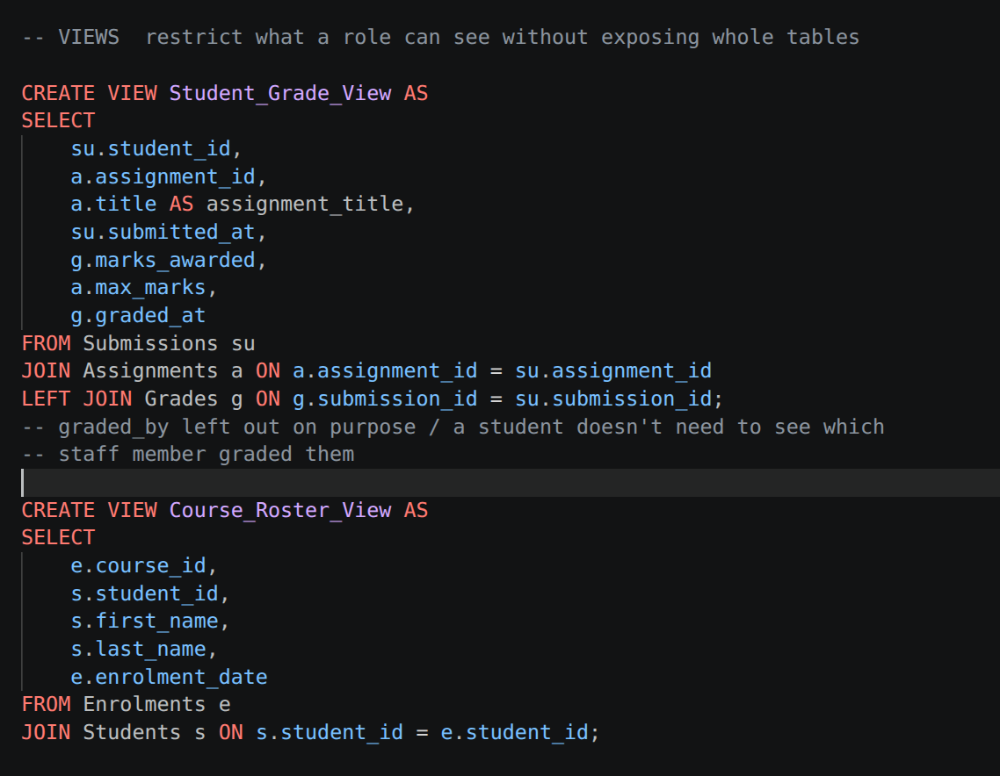
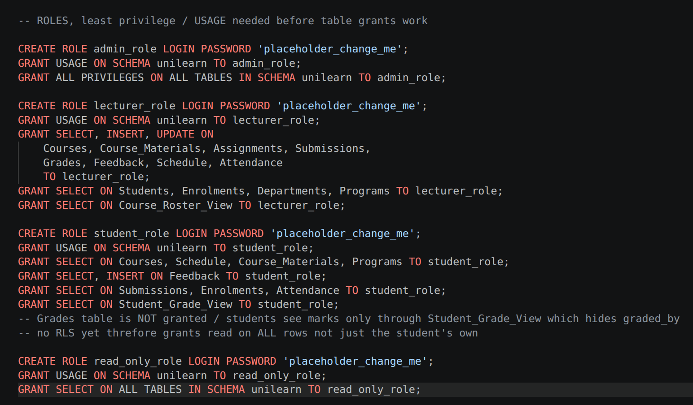

### 1.5 Verification

I tested this against a live PostgreSQL 18 instance rather than assuming it from the schema text. `schema.sql` imported into a completely fresh database with zero errors, 16 `CREATE TABLE`, 2 `CREATE VIEW`, 4 `CREATE ROLE` plus their grants.

| Test | Action | Result |
|---|---|---|
| FK rejection | Insert an `Enrolments` row referencing `student_id = 999` (doesn't exist) | Rejected. `violates foreign key constraint` |
| CHECK rejection | Insert a `Notifications` row with both recipient FKs `NULL` | Rejected. `violates check constraint "notifications_check"` |
| CHECK rejection | Insert a `Notifications` row with both recipient FKs set | Rejected. Same constraint |
| CHECK acceptance | Insert a `Notifications` row with exactly one recipient FK set | Succeeds |
| UNIQUE rejection | Insert a duplicate `(student_id, course_id)` into `Enrolments` | Rejected. `violates unique constraint` |
| Privilege | `lecturer_role`. `SELECT` on `Departments` | Succeeds. Granted explicitly |
| Privilege | `lecturer_role`. `INSERT`/`UPDATE` on `Departments` | Rejected. `permission denied` |
| Privilege | `read_only_role`. `INSERT` on `Departments` | Rejected. `permission denied` |
| Privilege | `read_only_role`. `SELECT` on `Departments` | Succeeds |
| View security | `student_role`. `SELECT` on `Student_Grade_View` | Succeeds |
| View security | `student_role`. `SELECT` on `Grades` directly | Rejected. `permission denied for table grades` |

One result is worth stating precisely. `lecturer_role` can read `Departments`, granted so a lecturer can see which department a course belongs to, but cannot write to it. Least privilege here means a role reads what it needs and writes only what it owns, not zero access outside its core tables.

## Task 2: Configuration Folder for PostgreSQL Security

`config/postgresql.conf` and `config/pg_hba.conf` are the two files that set the security posture. `server.crt` and `server.key` exist to support them, and `README.md` documents installation.

**`postgresql.conf`.** `listen_addresses = 'localhost'` means the server accepts connections only from this machine, since I assumed the app tier runs alongside it rather than over a network interface. `port = 5432` and `max_connections = 100` are left at conventional values. `ssl = on` plus `ssl_cert_file`/`ssl_key_file` turns on TLS for any connection that isn't a local Unix socket. `password_encryption = scram-sha-256` selects the stronger of PostgreSQL's two password hash schemes over the legacy MD5 default, and never sends the password itself over the wire, only a challenge response proof. `logging_collector`, `log_connections`, `log_disconnections`, and `log_statement = 'mod'` together log every write plus every connect and disconnect event, an audit trail a shared academic database needs. `autovacuum = on` keeps dead rows from accumulating on disk. `shared_buffers` and `work_mem` are left at defaults appropriate for a small install.

**`pg_hba.conf`.** Rules are checked top to bottom, first match wins, so ordering carries as much meaning as the individual rules. `local` (Unix socket) connections need `scram-sha-256`. Even same machine access is authenticated, not trusted implicitly. Loopback TCP (`127.0.0.1/32`, `::1/128`) must additionally use `hostssl`, not `host`. SSL is mandatory even for a connection that never leaves the machine, so encryption isn't something an administrator can skip by accident just by connecting locally. One illustrative subnet, `10.20.1.0/24`, is allowed to reach the `unilearn` database remotely, again `hostssl` only, standing in for a segmented app tier network. The last two lines reject every other address explicitly, `0.0.0.0/0` and `::/0`, rather than relying on the absence of a matching rule. The intent, that the database is not reachable from the open internet, is visible directly in the file rather than implied by default deny behaviour.

**`server.crt` and `server.key`.** A self signed certificate and key pair I generated for this coursework, providing the material `ssl = on` needs. I set `server.key` to `chmod 600`, readable only by its owner, since a private key readable by other local accounts is not really private.

**Rule scope, not just rule presence.** The remote rule is scoped to `hostssl unilearn all 10.20.1.0/24`, not `hostssl all all 10.20.1.0/24`. A host on that subnet still can't reach any database other than `unilearn`, which matters once more than one project shares a server. The loopback rules stay `all`, since loopback is the trusted local admin path. No plaintext `host` rule exists anywhere in the file. TLS is enforced by there being no alternative, not by a setting that could be left disabled.

**Installation**, per `config/README.md`. Copy all four files into the PostgreSQL data directory, found with `SHOW data_directory;` or the `-D` path passed to `initdb`. Run `chmod 600 server.key`. Then `pg_ctl restart -D <data_directory>` for the settings to take effect. `postgresql.conf` changes need a restart rather than a reload because several of the settings here, `listen_addresses` and `ssl_cert_file`, are only read at server start.

`max_connections = 100` is a security relevant choice too, not just a capacity one. An unbounded limit turns a slow client or retry loop into a resource exhaustion path, since every connection holds server memory regardless of use. `log_connections` and `log_disconnections` exist for the same reason `log_statement = mod` does. An unusual pattern is only visible after the fact if it was logged at the time.

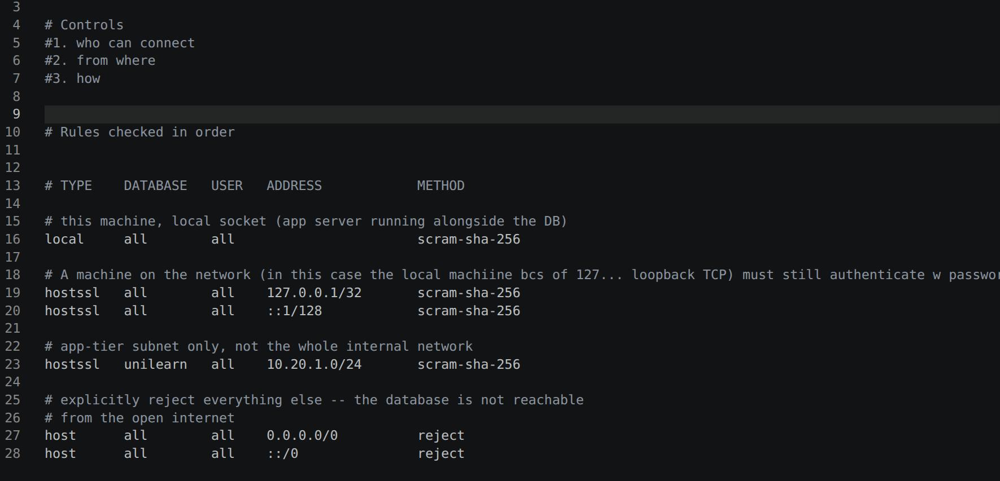
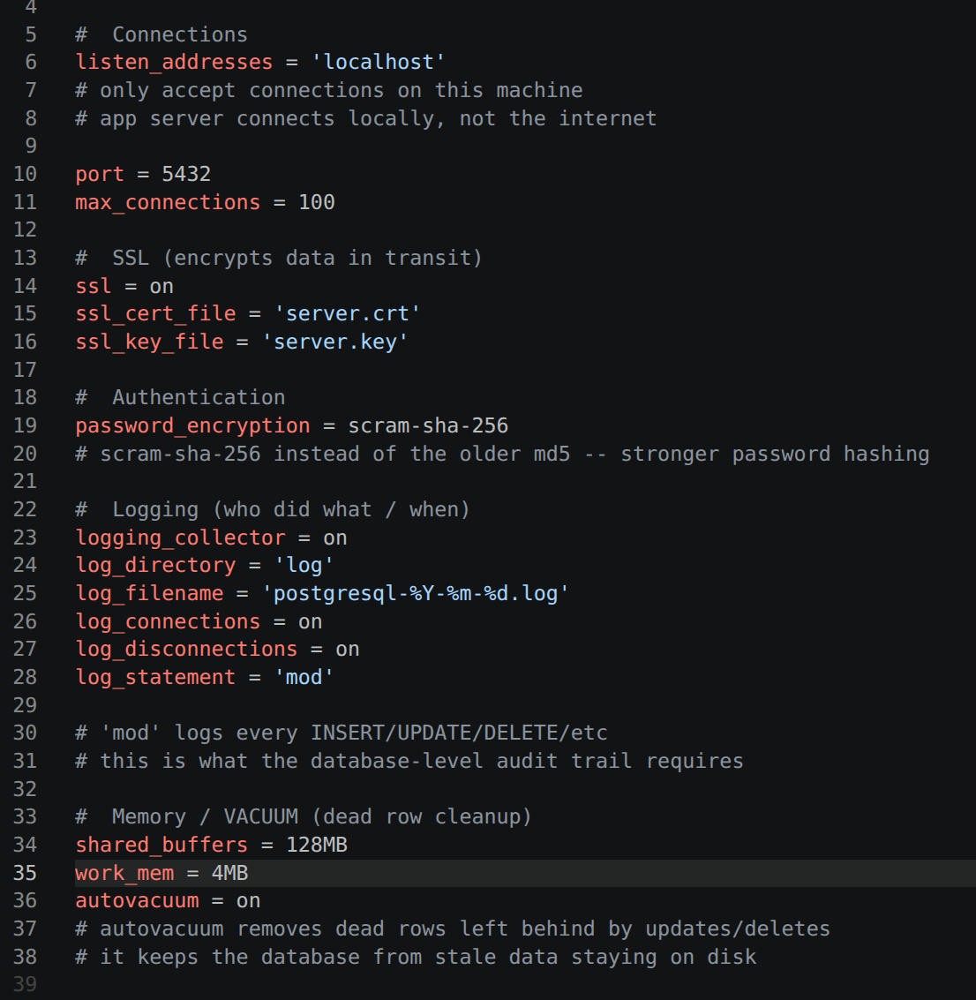
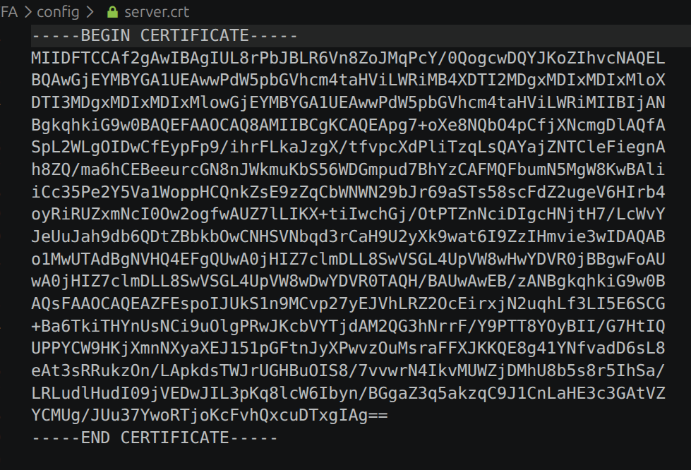

**Verification.** I couldn't safely apply this config to the live system PostgreSQL instance directly, it would need root and a full service restart of a shared instance. Instead I built an isolated throwaway PostgreSQL 18 instance in a scratch directory, dropped in the project's actual `postgresql.conf`, `pg_hba.conf`, `server.crt`, and `server.key` unmodified, only the port number changed to avoid clashing with the running system instance, and tested it directly.

| Test | Result |
|---|---|
| Plaintext TCP connection (`sslmode=disable`) | Rejected. `pg_hba.conf rejects connection ... no encryption` |
| SSL TCP connection (`sslmode=require`) | Succeeds. `TLSv1.3`, `TLS_AES_256_GCM_SHA384` |
| Password hash scheme in use | `SCRAM-SHA-256`, confirmed via `pg_authid` |
| `log_statement = mod` | A `CREATE TABLE`, `INSERT`, `DROP TABLE` sequence appeared in the log file verbatim |

## Task 3: SQL Business Logic Executable Script

`business_logic.sh` creates three PL/pgSQL functions against the `unilearn` schema, seeds minimal demonstration data, and calls each function to show its behaviour. `IM.sql` truncates every table with `RESTART IDENTITY CASCADE` without touching structure, so the two scripts together give a repeatable reset and demo cycle. This is what lets the executable be run more than once during marking.

I wrote the script as a `.sh` wrapping `psql` calls rather than a plain `.sql` file, per the brief's requirement that the executable be a shell script, not a SQL dump. Each stage, function creation, seeding, each demo call, is a separate `psql` invocation, so the output stays readable as labelled steps rather than one undifferentiated block of results.

`IM.sql` uses `TRUNCATE ... RESTART IDENTITY CASCADE` rather than `DELETE FROM` on each table. `TRUNCATE` is faster since it doesn't scan or log individual rows. `RESTART IDENTITY` resets every `IDENTITY` sequence, so a fresh run produces the same `student_id`, `enrolment_id`, and so on, as the last one. `CASCADE` clears tables in dependency order automatically, rather than me listing 16 tables by hand in an order that respects foreign keys.

| Function | Behaviour | Why |
|---|---|---|
| `fn_enrol_student` | Enrols a student in a course. If already enrolled, raises a notice and returns the existing `enrolment_id` instead of erroring | Enrolling twice is a normal user action, a double click or a retry, not an error condition. I treated this as a business logic decision, not a schema one, so it lives in the function rather than relaxing the `UNIQUE` constraint |
| `fn_course_average` | Returns the average `marks_awarded` across a course's graded submissions, or `NULL` if nothing is graded yet | Returns `NULL`, not `0`. An ungraded course is not the same as one averaging zero |
| `fn_record_attendance` | Inserts an attendance record. Does nothing on a duplicate, using `ON CONFLICT (student_id, schedule_id, attendance_date) DO NOTHING` | Marking the same session twice shouldn't crash a real register |

**A genuinely interesting result** came from running `business_logic.sh` again against a database that still had earlier test data in it, rather than a freshly reset one. The script's raw seed inserts failed loudly and correctly.

```
ERROR:  duplicate key value violates unique constraint "departments_department_name_key"
ERROR:  duplicate key value violates unique constraint "roles_role_name_key"
ERROR:  duplicate key value violates unique constraint "programs_program_name_key"
ERROR:  duplicate key value violates unique constraint "staff_email_key"
ERROR:  duplicate key value violates unique constraint "students_email_key"
```

But calling `fn_enrol_student(1, 1)` a second time against the same already seeded data didn't error. It printed `NOTICE: Student 1 already enrolled in course 1 (enrolment_id 1)` and returned the existing row. Same story for `fn_record_attendance`. Called twice for the same session, the second call silently did nothing, and `SELECT count(*) FROM Attendance` stayed at 1. This is the schema constraint layer and the business logic layer doing their jobs differently on purpose, not a bug. A raw duplicate insert should fail hard, while a function representing a real user action should handle an already done case gracefully. One note for anyone rerunning the demo without a reset in between, `Courses`, `Schedule`, and `Assignments` carry no `UNIQUE` constraint on their seed columns, so reseeding against them duplicates rows silently rather than erroring.

The script's own `set -e` didn't stop it partway through this, and that is expected, not a flaw. `set -e` aborts the bash script if a command exits non zero, but each seeding block is a single `psql` invocation reading a whole heredoc of SQL statements. `psql`, without `ON_ERROR_STOP`, reports each failing statement and moves to the next one within that invocation, then still exits with success once the heredoc is done. That is why the five errors printed rather than killing the script, and why the run still finished with usable output for the rest of the demo.

I confirmed the full cycle was clean. `business_logic.sh`, then `IM.sql`, then `business_logic.sh` again, against a freshly reset database, produced identical output both times with zero errors, including the `fn_course_average` calls, which returned `NULL` before any grade existed and `42.00` immediately after I inserted one, in both runs.

None of the three functions is `SECURITY DEFINER`, so each runs with the privileges of whichever role calls it, not the privileges of whoever created it. I tested this directly. `student_role` calling `fn_enrol_student` for a pair it is already enrolled in works fine, since that path only selects. But `student_role` calling it for a genuinely new enrolment fails, with `ERROR: permission denied for table enrolments`, because the function's insert runs as `student_role`, which only has `SELECT` on `Enrolments` (§1.4). As written, the enrolment function is only usable end to end by a role with write access to `Enrolments`, meaning `lecturer_role` or `admin_role`, not by the student it is named for. I am flagging this as a real, verified gap between the function's name and what `student_role` can actually do with it, rather than leaving it to look like it works for students just because it compiles and runs under a higher privileged role.

## Testing of User Journeys

**A student enrols, is graded, and checks their result.** `fn_enrol_student` creates the `Enrolments` row. A lecturer later inserts a `Submissions` row and a `Grades` row against it. The student queries `Student_Grade_View` (§1.4) and sees their mark and `max_marks`, but not `graded_by`. A direct `SELECT` on `Grades` from the same session is rejected (§1.5), confirming the view is the only path.

**A lecturer records attendance across repeated sessions.** `fn_record_attendance` is called once per class. Calling it again for a session already marked does nothing rather than erroring (§3), so a resubmitted register can't create duplicate rows or crash the request.

**An unauthorised or unencrypted connection is refused before it can do anything.** A plaintext TCP connection is rejected at the connection stage, before authentication runs (§2). A `read_only_role` session that does connect still cannot write (§1.5). Network and transport, then privilege, each have to pass independently for a write to happen.

## Security Design Decisions

Least privilege roles, TLS only remote access with an explicit deny all, SCRAM SHA 256 hashing, and full write and connection audit logging form the core of the design, covered in §1 and §2. View based column hiding keeps a sensitive column out of a role's reach without per column grants, which PostgreSQL doesn't support directly. I verified every access control decision live under `SET ROLE`, not just by reading the grant statements.

**Known limitations, not fixed, listed on purpose.**

1. No Row Level Security. `student_role`'s grant on `Student_Grade_View` covers every row, not just that student's own. Enforcing an own rows only rule needs RLS policies, not built yet.
2. No cross table CHECK on `Grades.marks_awarded` against `Assignments.max_marks`. This needs a trigger. I left it out to keep the submitted schema simple and fully trigger free.
3. Self signed SSL certificate. It encrypts the connection but isn't verifiable against a trusted CA.
4. `CREATE ROLE ... PASSWORD 'placeholder_change_me'`. Every role password in `schema.sql` is a placeholder, not a real credential.
5. `10.20.1.0/24` in `pg_hba.conf` is illustrative, standing in for a segmented app tier subnet. It is not a real deployed address range.

## AI Use Declaration

I used AI for the following.

- Ran the scripts against a live PostgreSQL instance to check my test claims held up.
- Caught a factual error in my privilege test notes, lecturer access to `Departments` is read only, not blocked outright.
- Formatted the report into LaTeX, matching an example report of mine.
- Helped me along with `business_logic.sh` and taught me bash as I went, since I had little experience with it. Also helped write the comments.
- Debugging help on the isolated PostgreSQL instance used for config verification.
- Grammar, punctuation, and phrasing edits, and cut the word count down by rephrasing.
- Added the section cross references, and mapped the schema to the GDPR point in the brief.

## Appendix: Full Code Listings

*(Not counted against the report word limit.)*

### `schema.sql`

```sql
-- UniLearn Hub schema (draft)

CREATE SCHEMA unilearn;
SET search_path TO unilearn;

-- no dependencies

CREATE TABLE Departments (
    department_id INTEGER GENERATED ALWAYS AS IDENTITY PRIMARY KEY,
    department_name VARCHAR(50) UNIQUE NOT NULL
);

CREATE TABLE Roles (
    role_id INTEGER GENERATED ALWAYS AS IDENTITY PRIMARY KEY,
    role_name VARCHAR(30) UNIQUE NOT NULL
);

-- needs Departments / Roles

CREATE TABLE Programs (
    program_id INTEGER GENERATED ALWAYS AS IDENTITY PRIMARY KEY,
    program_name VARCHAR(50) UNIQUE NOT NULL,
    department_id INTEGER REFERENCES Departments(department_id) NOT NULL
);

CREATE TABLE Staff (
    staff_id INTEGER GENERATED ALWAYS AS IDENTITY PRIMARY KEY,
    first_name VARCHAR(50) NOT NULL,
    last_name VARCHAR(50) NOT NULL,
    email VARCHAR(100) UNIQUE NOT NULL,
    department_id INTEGER REFERENCES Departments(department_id) NOT NULL,
    role_id INTEGER REFERENCES Roles(role_id) NOT NULL
);

-- needs Programs

CREATE TABLE Students (
    student_id INTEGER GENERATED ALWAYS AS IDENTITY PRIMARY KEY,
    first_name VARCHAR(50) NOT NULL,
    last_name VARCHAR(50) NOT NULL,
    email VARCHAR(100) UNIQUE NOT NULL,
    program_id INTEGER REFERENCES Programs(program_id) NOT NULL
);

CREATE TABLE Courses (
    course_id INTEGER GENERATED ALWAYS AS IDENTITY PRIMARY KEY,
    course_name VARCHAR(50) NOT NULL,
    credits INTEGER NOT NULL,
    program_id INTEGER REFERENCES Programs(program_id) NOT NULL
);

-- needs Courses / Staff

CREATE TABLE Course_Materials (
    material_id INTEGER GENERATED ALWAYS AS IDENTITY PRIMARY KEY,
    course_id INTEGER REFERENCES Courses(course_id) NOT NULL,
    staff_id INTEGER REFERENCES Staff(staff_id) NOT NULL,
    title VARCHAR(100) NOT NULL,
    upload_date DATE NOT NULL
);

CREATE TABLE Assignments (
    assignment_id INTEGER GENERATED ALWAYS AS IDENTITY PRIMARY KEY,
    course_id INTEGER REFERENCES Courses(course_id) NOT NULL,
    title VARCHAR(100) NOT NULL,
    due_date DATE NOT NULL,
    max_marks NUMERIC(5,2) NOT NULL CHECK (max_marks > 0)
);

CREATE TABLE Schedule (
    schedule_id INTEGER GENERATED ALWAYS AS IDENTITY PRIMARY KEY,
    course_id INTEGER REFERENCES Courses(course_id) NOT NULL,
    day_of_week VARCHAR(10) NOT NULL
        CHECK (day_of_week IN ('Monday','Tuesday','Wednesday','Thursday','Friday','Saturday','Sunday')),
    start_time TIME NOT NULL,
    end_time TIME NOT NULL,
    location VARCHAR(50) NOT NULL,
    CHECK (end_time > start_time)
);

-- junction tables (many-to-many)

CREATE TABLE Enrolments (
    enrolment_id INTEGER GENERATED ALWAYS AS IDENTITY PRIMARY KEY,
    student_id INTEGER REFERENCES Students(student_id) NOT NULL,
    course_id INTEGER REFERENCES Courses(course_id) NOT NULL,
    enrolment_date DATE NOT NULL,
    UNIQUE (student_id, course_id)
);

CREATE TABLE Submissions (
    submission_id INTEGER GENERATED ALWAYS AS IDENTITY PRIMARY KEY,
    assignment_id INTEGER REFERENCES Assignments(assignment_id) NOT NULL,
    student_id INTEGER REFERENCES Students(student_id) NOT NULL,
    submitted_at TIMESTAMP NOT NULL,
    file_reference VARCHAR(255) NOT NULL,
    UNIQUE (assignment_id, student_id)
);

-- needs Submissions / Staff

CREATE TABLE Grades (
    grade_id INTEGER GENERATED ALWAYS AS IDENTITY PRIMARY KEY,
    submission_id INTEGER REFERENCES Submissions(submission_id) UNIQUE NOT NULL,
    marks_awarded NUMERIC(5,2) NOT NULL CHECK (marks_awarded >= 0),
    graded_by INTEGER REFERENCES Staff(staff_id) NOT NULL,
    graded_at TIMESTAMP NOT NULL
);

-- needs Students / Schedule

CREATE TABLE Attendance (
    attendance_id INTEGER GENERATED ALWAYS AS IDENTITY PRIMARY KEY,
    student_id INTEGER REFERENCES Students(student_id) NOT NULL,
    schedule_id INTEGER REFERENCES Schedule(schedule_id) NOT NULL,
    attendance_date DATE NOT NULL,
    status VARCHAR(10) NOT NULL CHECK (status IN ('present','absent','late')),
    UNIQUE (student_id, schedule_id, attendance_date)
);

CREATE TABLE Feedback (
    feedback_id INTEGER GENERATED ALWAYS AS IDENTITY PRIMARY KEY,
    student_id INTEGER REFERENCES Students(student_id) NOT NULL,
    course_id INTEGER REFERENCES Courses(course_id) NOT NULL,
    comments TEXT NOT NULL,
    submitted_at TIMESTAMP NOT NULL
);

-- recipient/sender: student or staff -- nullable FKs + CHECK, not a type column

CREATE TABLE Notifications (
    notification_id INTEGER GENERATED ALWAYS AS IDENTITY PRIMARY KEY,
    recipient_student_id INTEGER REFERENCES Students(student_id),
    recipient_staff_id INTEGER REFERENCES Staff(staff_id),
    message TEXT NOT NULL,
    sent_at TIMESTAMP NOT NULL,
    read_status BOOLEAN NOT NULL DEFAULT FALSE,
    CHECK (
        (recipient_student_id IS NOT NULL AND recipient_staff_id IS NULL)
        OR
        (recipient_student_id IS NULL AND recipient_staff_id IS NOT NULL)
    )
);

CREATE TABLE Messages (
    message_id INTEGER GENERATED ALWAYS AS IDENTITY PRIMARY KEY,
    sender_student_id INTEGER REFERENCES Students(student_id),
    sender_staff_id INTEGER REFERENCES Staff(staff_id),
    recipient_student_id INTEGER REFERENCES Students(student_id),
    recipient_staff_id INTEGER REFERENCES Staff(staff_id),
    body TEXT NOT NULL,
    sent_at TIMESTAMP NOT NULL,
    CHECK (
        (sender_student_id IS NOT NULL AND sender_staff_id IS NULL)
        OR
        (sender_student_id IS NULL AND sender_staff_id IS NOT NULL)
    ),
    CHECK (
        (recipient_student_id IS NOT NULL AND recipient_staff_id IS NULL)
        OR
        (recipient_student_id IS NULL AND recipient_staff_id IS NOT NULL)
    )
);

-- VIEWS -- restrict what a role can see without exposing whole tables

CREATE VIEW Student_Grade_View AS
SELECT
    su.student_id,
    a.assignment_id,
    a.title AS assignment_title,
    su.submitted_at,
    g.marks_awarded,
    a.max_marks,
    g.graded_at
FROM Submissions su
JOIN Assignments a ON a.assignment_id = su.assignment_id
LEFT JOIN Grades g ON g.submission_id = su.submission_id;
-- graded_by left out on purpose -- a student doesn't need to see which
-- staff member graded them

CREATE VIEW Course_Roster_View AS
SELECT
    e.course_id,
    s.student_id,
    s.first_name,
    s.last_name,
    e.enrolment_date
FROM Enrolments e
JOIN Students s ON s.student_id = e.student_id;
-- student email left out -- roster doesn't need it

-- ROLES, least privilege -- USAGE needed before table grants work

CREATE ROLE admin_role LOGIN PASSWORD 'placeholder_change_me';
GRANT USAGE ON SCHEMA unilearn TO admin_role;
GRANT ALL PRIVILEGES ON ALL TABLES IN SCHEMA unilearn TO admin_role;

CREATE ROLE lecturer_role LOGIN PASSWORD 'placeholder_change_me';
GRANT USAGE ON SCHEMA unilearn TO lecturer_role;
GRANT SELECT, INSERT, UPDATE ON
    Courses, Course_Materials, Assignments, Submissions,
    Grades, Feedback, Schedule, Attendance
    TO lecturer_role;
GRANT SELECT ON Students, Enrolments, Departments, Programs TO lecturer_role;
GRANT SELECT ON Course_Roster_View TO lecturer_role;

CREATE ROLE student_role LOGIN PASSWORD 'placeholder_change_me';
GRANT USAGE ON SCHEMA unilearn TO student_role;
GRANT SELECT ON Courses, Schedule, Course_Materials, Programs TO student_role;
GRANT SELECT, INSERT ON Feedback TO student_role;
GRANT SELECT ON Submissions, Enrolments, Attendance TO student_role;
GRANT SELECT ON Student_Grade_View TO student_role;
-- Grades table itself is NOT granted -- students see marks only through
-- Student_Grade_View, which hides graded_by
-- no RLS yet -- this grants read on ALL rows, not just the student's own

CREATE ROLE read_only_role LOGIN PASSWORD 'placeholder_change_me';
GRANT USAGE ON SCHEMA unilearn TO read_only_role;
GRANT SELECT ON ALL TABLES IN SCHEMA unilearn TO read_only_role;
```

### `business_logic.sh`

```bash
#!/bin/bash
# business_logic.sh -- UniLearn Hub business logic demonstration
#
# Creates three PL/pgSQL functions against the unilearn schema, then
# runs a demonstration: seeds minimal data, calls each function, and
# prints the result. Re-runnable: run IM.sql between executions to
# reset to a clean state.
#
# Usage: ./business_logic.sh [database_name]

set -e  # stop immediately if any step fails

DB_NAME="${1:-unilearn_hub}"
PSQL="psql -d $DB_NAME"

echo "=== Creating business logic functions ==="

$PSQL <<'SQL'
SET search_path TO unilearn;

-- Enrols a student in a course. Returns the enrolment_id.
-- If already enrolled, notifies and returns the existing row's id
-- instead of erroring -- this is a business rule choice, not a schema
-- constraint, so it belongs here rather than in a CHECK/UNIQUE.
CREATE OR REPLACE FUNCTION fn_enrol_student(p_student_id INT, p_course_id INT)
RETURNS INT AS $$
DECLARE
    v_enrolment_id INT;
BEGIN
    SELECT enrolment_id INTO v_enrolment_id
    FROM Enrolments
    WHERE student_id = p_student_id AND course_id = p_course_id;

    IF v_enrolment_id IS NOT NULL THEN
        RAISE NOTICE 'Student % already enrolled in course % (enrolment_id %)',
            p_student_id, p_course_id, v_enrolment_id;
        RETURN v_enrolment_id;
    END IF;

    INSERT INTO Enrolments (student_id, course_id, enrolment_date)
    VALUES (p_student_id, p_course_id, CURRENT_DATE)
    RETURNING enrolment_id INTO v_enrolment_id;

    RETURN v_enrolment_id;
END;
$$ LANGUAGE plpgsql;

-- Returns a course's average mark across all graded submissions.
-- Returns NULL if nothing has been graded yet (not 0 -- an ungraded
-- course isn't the same as a course averaging zero).
CREATE OR REPLACE FUNCTION fn_course_average(p_course_id INT)
RETURNS NUMERIC AS $$
DECLARE
    v_average NUMERIC;
BEGIN
    SELECT AVG(g.marks_awarded) INTO v_average
    FROM Grades g
    JOIN Submissions su ON su.submission_id = g.submission_id
    JOIN Assignments a ON a.assignment_id = su.assignment_id
    WHERE a.course_id = p_course_id;

    RETURN v_average;
END;
$$ LANGUAGE plpgsql;

-- Records attendance for a student at a scheduled session.
-- Silently does nothing on a duplicate (student/schedule/date already
-- has a record) rather than erroring -- re-marking the same session
-- shouldn't crash a real register.
CREATE OR REPLACE FUNCTION fn_record_attendance(
    p_student_id INT, p_schedule_id INT, p_date DATE, p_status VARCHAR
)
RETURNS VOID AS $$
BEGIN
    INSERT INTO Attendance (student_id, schedule_id, attendance_date, status)
    VALUES (p_student_id, p_schedule_id, p_date, p_status)
    ON CONFLICT (student_id, schedule_id, attendance_date) DO NOTHING;
END;
$$ LANGUAGE plpgsql;
SQL

echo "=== Functions created ==="
echo ""
echo "=== Seeding minimal demonstration data ==="

$PSQL <<'SQL'
SET search_path TO unilearn;

INSERT INTO Departments (department_name) VALUES ('Computer Science');
INSERT INTO Roles (role_name) VALUES ('Lecturer');
INSERT INTO Programs (program_name, department_id) VALUES ('BSc Computing', 1);
INSERT INTO Staff (first_name, last_name, email, department_id, role_id)
    VALUES ('Beverly', 'Crusher', 'bcrusher@test.edu', 1, 1);
INSERT INTO Students (first_name, last_name, email, program_id)
    VALUES ('Jean', 'Picard', 'jpicard@test.edu', 1);
INSERT INTO Courses (course_name, credits, program_id) VALUES ('Databases', 15, 1);
INSERT INTO Schedule (course_id, day_of_week, start_time, end_time, location)
    VALUES (1, 'Monday', '09:00', '11:00', 'Room A1');
INSERT INTO Assignments (course_id, title, due_date, max_marks)
    VALUES (1, 'Assignment 1', '2026-09-01', 50);
SQL

echo "=== Demonstration data seeded ==="
echo ""
echo "=== Demo 1: fn_enrol_student ==="
$PSQL -c "SET search_path TO unilearn; SELECT fn_enrol_student(1, 1) AS enrolment_id;"

echo "=== Demo 1b: calling again should notice, not duplicate ==="
$PSQL -c "SET search_path TO unilearn; SELECT fn_enrol_student(1, 1) AS enrolment_id;"

echo ""
echo "=== Demo 2: fn_course_average (before any grade exists -> NULL) ==="
$PSQL -c "SET search_path TO unilearn; SELECT fn_course_average(1) AS average_before_grading;"

$PSQL <<'SQL'
SET search_path TO unilearn;
INSERT INTO Submissions (assignment_id, student_id, submitted_at, file_reference)
    VALUES (1, 1, now(), '/uploads/a1.pdf');
INSERT INTO Grades (submission_id, marks_awarded, graded_by, graded_at)
    VALUES (1, 42, 1, now());
SQL

echo "=== Demo 2b: fn_course_average (after grading -> 42.00) ==="
$PSQL -c "SET search_path TO unilearn; SELECT fn_course_average(1) AS average_after_grading;"

echo ""
echo "=== Demo 3: fn_record_attendance ==="
$PSQL -c "SET search_path TO unilearn; SELECT fn_record_attendance(1, 1, CURRENT_DATE, 'present');"
$PSQL -c "SET search_path TO unilearn; SELECT * FROM Attendance;"

echo "=== Demo 3b: recording the same session again should not error or duplicate ==="
$PSQL -c "SET search_path TO unilearn; SELECT fn_record_attendance(1, 1, CURRENT_DATE, 'present');"
$PSQL -c "SET search_path TO unilearn; SELECT count(*) AS attendance_row_count FROM Attendance;"

echo ""
echo "=== Business logic demonstration complete ==="
```

### `IM.sql`

```sql
-- IM.sql -- resets all UniLearn Hub data between test runs.
-- Structure (tables/views/roles/functions) is untouched -- only rows
-- are cleared, so the business logic script can be re-run repeatedly
-- against a clean state.

SET search_path TO unilearn;

TRUNCATE TABLE
    Departments, Roles, Programs, Staff, Students, Courses,
    Course_Materials, Assignments, Schedule, Enrolments, Submissions,
    Grades, Attendance, Feedback, Notifications, Messages
RESTART IDENTITY CASCADE;
```

### `config/postgresql.conf`

```
# UniLearn Hub
# Security-relevant settings only 
# Anything not listed here uses PostgreSQL's default settings

#  Connections
listen_addresses = 'localhost'
# only accept connections on this machine 
# app server connects locally, not the internet

port = 5432
max_connections = 100

#  SSL (encrypts data in transit) 
ssl = on
ssl_cert_file = 'server.crt'
ssl_key_file = 'server.key'

#  Authentication 
password_encryption = scram-sha-256
# scram-sha-256 instead of the older md5 -- stronger password hashing

#  Logging (who did what / when) 
logging_collector = on
log_directory = 'log'
log_filename = 'postgresql-%Y-%m-%d.log'
log_connections = on
log_disconnections = on
log_statement = 'mod'

# 'mod' logs every INSERT/UPDATE/DELETE/etc
# this is what the database-level audit trail requires

#  Memory / VACUUM (dead row cleanup) 
shared_buffers = 128MB
work_mem = 4MB
autovacuum = on
# autovacuum removes dead rows left behind by updates/deletes 
# it keeps the database from stale data staying on disk
```

### `config/pg_hba.conf`

```
# UniLearn Hub


# Controls 
#1. who can connect
#2. from where
#3. how


# Rules checked in order


# TYPE    DATABASE   USER   ADDRESS            METHOD

# this machine, local socket (app server running alongside the DB)
local     all        all                       scram-sha-256

# A machine on the network (in this case the local machiine bcs of 127... loopback TCP) must still authenticate w password
hostssl   all        all    127.0.0.1/32       scram-sha-256
hostssl   all        all    ::1/128            scram-sha-256

# app-tier subnet only, not the whole internal network
hostssl   unilearn   all    10.20.1.0/24       scram-sha-256

# explicitly reject everything else -- the database is not reachable
# from the open internet
host      all        all    0.0.0.0/0          reject
host      all        all    ::/0               reject
```

### `config/README.md`

```
# UniLearn Hub -- config

PostgreSQL security configuration for the UniLearn Hub database.

## Files

**postgresql.conf**
Server-wide settings. Restricts network exposure (`listen_addresses`),
turns on SSL, sets stronger password hashing (`scram-sha-256`),
enables full write logging (`log_statement = mod`) for audit purposes,
and keeps autovacuum on so dead rows from updates/deletes don't
linger on disk.

**pg_hba.conf**
Controls who can connect, from where, and how. Local/loopback
connections must authenticate with `scram-sha-256`. Only a specific
trusted subnet is allowed to connect remotely, and only over SSL
(`hostssl`, not `host`). Everything else is explicitly rejected --
the database is not reachable from the open internet.

**server.key / server.crt**
Self-signed key/cert pair, backs the SSL that `postgresql.conf` and
`pg_hba.conf` require. `server.key` is in the coursework submission
zip but left out of this public GitHub repo, since a real private key
has no business being published even when it's a coursework
placeholder.

## Installation

1. Copy all four files into the PostgreSQL data directory (found via
   `SHOW data_directory;` on an existing install, or the `-D` path
   passed to `initdb`).
2. Set correct permissions on the private key:
   `chmod 600 server.key`
3. Restart PostgreSQL for the settings to take effect:
   `pg_ctl restart -D <data_directory>`

## Notes

- `10.20.1.0/24` in `pg_hba.conf` is illustrative -- stands in for a
  segmented app-tier subnet, not a real deployed range. Replace before
  deploying.
- Self-signed cert: encrypts, but isn't verifiable like a CA-signed
  one.
- `CREATE ROLE` passwords in `schema.sql` are placeholders, not real
  credentials.
- Tested against a live PostgreSQL 18 instance: SSL, `scram-sha-256`,
  and `log_statement=mod` all confirmed working; plaintext (non-SSL)
  connections correctly rejected by `pg_hba.conf`.
```
